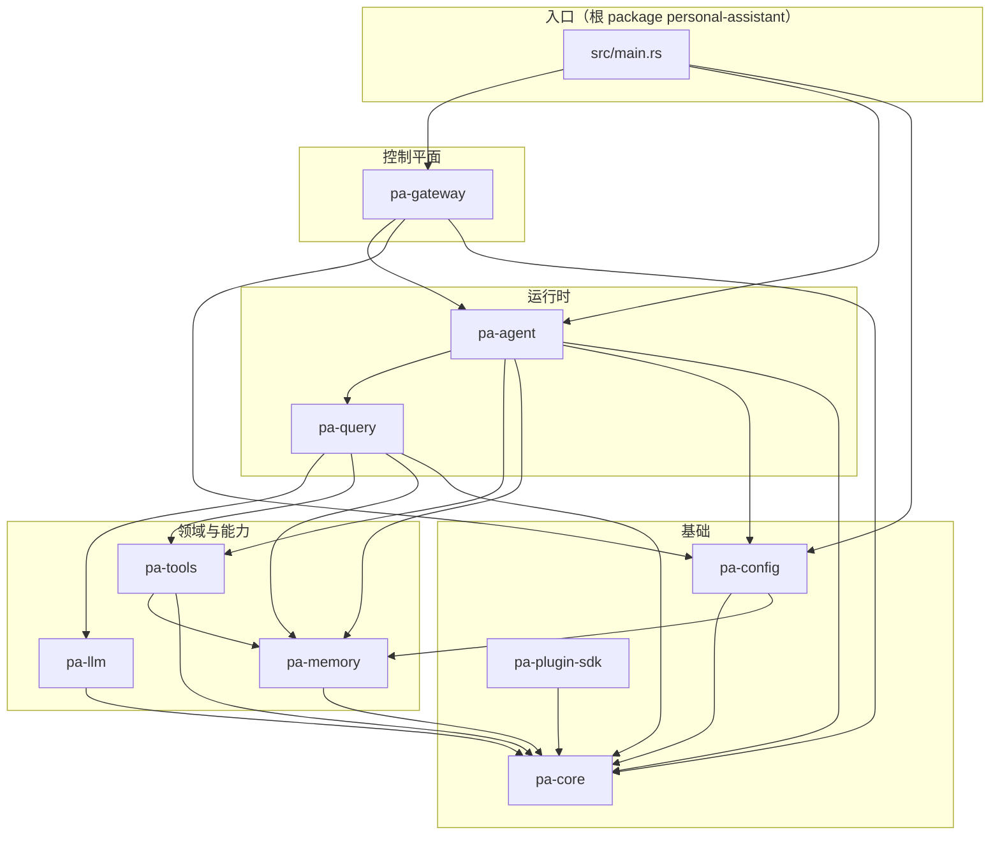

# 架构说明

本文描述当前 Rust Workspace 的分层方式、crate 间依赖方向，以及从「配置加载」到「Gateway / Agent / 查询循环」的预期组装关系。内容以仓库内 `Cargo.toml` 与模块 `lib.rs` 为准。

## 分层与依赖方向

依赖应自上而下：越靠近「入口与 I/O」的 crate，可以依赖越靠下的「领域与基础设施」crate；避免反向依赖（例如 `pa-core` 不应依赖 `pa-agent`）。

说明：

- **pa-core**：消息、工具协议、错误类型等跨 crate 公共契约，不依赖其他内部 crate。
- **pa-config**：将 TOML 解析为 `Settings`，并向 `pa_memory::MemoryConfig` 做转换；依赖 `pa-core`、`pa-memory`。
- **pa-llm**：面向 `pa-core` 的 LLM 客户端抽象与具体提供商实现。
- **pa-memory**：MAGMA 记忆引擎（图、向量、查询、整合）；仅依赖 `pa-core`。
- **pa-tools**：内置工具实现；依赖 `pa-core`、`pa-memory`（如记忆类工具）。
- **pa-query**：Reask 查询循环引擎；组合 `pa-llm`、`pa-tools`、`pa-memory`。
- **pa-agent**：Agent 运行时（路由、沙箱、认证配置等）；组合 `pa-query`、`pa-tools`、`pa-memory`、`pa-config`。
- **pa-gateway**：基于 Axum / WebSocket 的控制平面；依赖 `pa-agent`、`pa-config`。
- **pa-plugin-sdk**：插件扩展点定义；当前为 SDK 形态，根二进制未强制引用，供后续插件化加载使用。

## 运行时数据流（概念）

1. **Gateway**：客户端通过 WebSocket 接入 `GatewayServer`，消息经 `protocol` 与 `Gateway` 调度到具体 Agent / 会话逻辑（详见 `crates/pa-gateway`）。
2. **Agent**：`pa-agent` 中的 `Agent` 与 `AgentRouter` 负责多 Agent 路由与运行时状态；工具执行可走 `SandboxExecutor` 等路径。
3. **Reask 循环**：`pa-query::QueryEngine` 驱动「LLM 响应 → `tool_use` → 执行工具 → 将 `tool_result` 写回上下文 → 再次请求」的闭环，并与记忆检索集成（见 `crates/pa-query/src/lib.rs` 模块注释）。

## 与 README 中愿景的对应关系

根 README 中的 OpenClaw 式 Gateway、Claude Code 式 Reask、MAGMA 多图谱记忆，在代码中分别主要落在 `pa-gateway`、`pa-query`、`pa-memory`。具体行为以各 crate 源码为准；若根二进制尚未接入上述模块，属于集成进度问题，而非架构分层错误。

## 当前集成状态（截至代码现状）

- 根包 `src/main.rs` 已接入 `src/cli.rs` 参数解析，并支持 `start` / `query` / `version` 子命令。
- 启动链路已包含核心组装流程：`Settings` 加载 → LLM / Memory / ToolRegistry 初始化 → `QueryEngine` → `Agent` → `Gateway`。
- `start` 模式已支持可选 MCP 工具加载、飞书通道初始化、任务库初始化与优雅关闭信号处理。

后续可继续加强的方向主要是「跨模块行为验证」与「端到端运行脚本完善」，而非主流程接线缺失。
